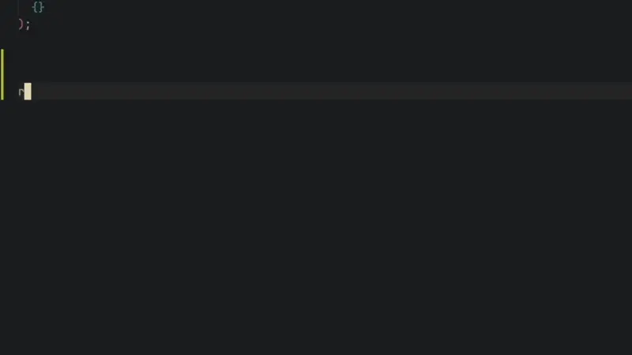

Simple type safe routing for Next.js app router

## Todo

### Bugs

### Features

- [ ] Implement `useParams`
- [ ] Implement `useSelectedLayoutSegment`
- [ ] Implement `useSelectedLayoutSegments`
- [ ] Look into parallel/intercepting routes
- [ ] Think about API of passing info (one big object, optional stuff etc)
- [ ] Fast pass for ZOD? (look into handling it as an optional peer dep)
- [ ] Support symmetric parsing of params

### Testing

- [ ] Runtime performance tests

## Example



```tsx
const router = new Router(
  page("", {
    children: [
      // Route group - not part of actual URL
      group("(auth)", {
        // Defined with NUQS, will be available to all children of this group
        query: {
          email: parseAsString,
        },
        children: [page("sign-in"), page("sign-up")],
      }),
      layout("orders", {
        // [path] notation is a dynamic route, automatically inferred as string
        children: [page("[orderId]", { children: [page("tracking-details")] })],
      }),
      // Use a page + children when you have both a layout and a page on a route
      page("items", {
        query: {
          // These are only available on the /items page and will not be shared with children
          page: {
            sortOn: parseAsStringEnum(["name", "price"]),
            sortOrder: parseAsStringEnum(["asc", "desc"]),
          },
          // These would be available on /items and all children of /items
          layout: {},
        },
        // dynamic routes can optionally define a StandardSchema
        children: [page("[itemId]", { params: z.uuid() })],
      }),
    ],
  })
);

// /sign-in?email=test@test.com (with URI encoding)
router.route("/(auth)/sign-in", {}, { email: "test@test.com" });

// Type error: not a valid route. Should be /sign-in
router.route("/(auth)/signIn", {}, { email: "test@test.com" });

// Type error: missing param itemId
router.route("/items/[itemId]", {}, {});

// Runtime error: not a valid UUID
router.route("/items/[itemId]", { itemId: "123" }, {});

export default router.implementPage("/(auth)/sign-in", async (props) => {
  const { query } = await props.parse();
  return <div>{query.email}</div>;
});

// Only available in client components
const [query, setQuery] = router.useLayoutQuery("/(auth)");

const selectedLayoutSegment = router.useSelectedLayoutSegment("/(auth)");
// "sign-in" | "sign-up"
```
